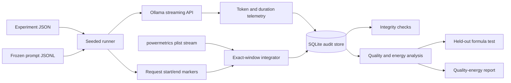

# CarbonBench-Mac experiment protocol

**Protocol version:** 1.0  
**Target host:** Apple M5 Pro, 18 CPU cores, 24 GB unified memory  
**Runtime:** Native Ollama on macOS  
**Core design:** Six models × 100 prompts × three rounds  
**Primary purpose:** Validate measurement repeatability and held-out-family prediction on one device

Freeze this protocol before the first core run. Record any change as a new protocol version and a new config hash.

## 1. Research claims

### 1.1 Claims that this experiment can test

The experiment can test these claims:

- Local Ollama telemetry is complete and repeatable on one fixed Mac.
- Estimated Apple SoC component energy changes with input work, output work, and model size.
- A low-complexity formula fitted on Qwen2.5 can predict two model families that it did not see during fitting.
- A smaller model can reduce local component energy while keeping deterministic task quality inside a fixed margin.
- Load, cache, output truncation, thermal state, and sample coverage can materially change a reported result.

### 1.2 Claims that this experiment cannot test

The experiment cannot directly test these claims:

- The wall-socket energy of this Mac without a wall meter.
- The energy or carbon of a closed cloud request.
- Datacentre PUE, provider batching, network energy, or server idle allocation.
- Training energy or embodied carbon.
- Cross-hardware energy rankings.
- Real-time South Australian carbon without a time-aligned grid-intensity source.

A held-out open model is a black-box analogue. It is not proof about a proprietary model.

## 2. Preregistered hypotheses

### H1. Repeatability

After warm-up, the median within-cell energy coefficient of variation must be at most 10%. At least 90% of repeated cells must have a coefficient of variation at most 10%.

If the shakedown coefficient of variation is 10–15%, increase the core from three to five rounds. If it remains above 15%, stop. Repair the measurement method before collecting more data.

### H2. Whole-system calibration

For 30–60 second workload blocks, calibrated SoC energy should agree with external wall energy with concordance at least 0.90. The 90% confidence interval for mean bias should lie inside ±10%.

This hypothesis is pending until a suitable external logging meter is available. Do not substitute `powermetrics` for this test.

### H3. Work relationship

Energy must increase with controlled input work and controlled output work. Within the dense Qwen2.5 family, energy for a fixed workload should be monotonic with model size in at least 80% of comparable cells.

### H4. Held-out postflight prediction

On model families and prompts not used for fitting:

- median absolute percentage error, or MdAPE, must be at most 20%;
- 90th-percentile absolute percentage error must be at most 40%;
- Spearman rank correlation must be at least 0.90;
- at least 80% of estimates must be within ±40%;
- the model must improve MdAPE by at least 20% against a global joules-per-token baseline.

Each held-out family must also be reported separately. A good pooled result cannot hide a failed family.

The proposal used the phrase “60% similarity.” This protocol replaces that phrase with a testable minimum: at least 80% of locked estimates must be within ±40% of the energy proxy. H4 uses stronger central-error targets.

### H5. Preflight prediction

A later preflight model may use only facts known before generation. It should reach:

- MdAPE at most 35%;
- at least 80% of estimates within ±50%;
- empirical interval coverage from 80% to 95%.

The current tool fits a postflight formula because it uses actual output token count. A preflight model must first predict output length from task stratum and requested cap.

### H6. Temperature equivalence extension

After control for actual input and output tokens, temperature 0 and temperature 0.8 should be equivalent within ±5% energy. Use paired seeds and a two-one-sided equivalence test.

This is an extension. It is not part of the supplied 1,800-request core.

### H7. Reasoning extension

Any energy increase from reasoning mode should be explained mainly by added output tokens. The residual reasoning-mode effect should be equivalent within ±10%.

Reasoning models must form a separate cohort. Do not silently mix models that expose hidden or visible reasoning with ordinary instruction models.

### H8. GreenLoop routing utility

For at least two task strata, a lower-cost routing choice must reduce energy by at least 25% while quality is no more than five percentage points below the strongest eligible model.

Quality is a gate. A short wrong answer is not an energy improvement.

## 3. Experimental units and independence

The request is the measurement unit. The model family is the transfer unit.

Thousands of prompt requests do not create thousands of independent model-family tests. The supplied core has two held-out dense families. This supports a credible pilot, not a universal transfer claim.

A stronger paper should use at least three to five additional held-out families, a second hardware platform, and a wall-power calibration subset.

## 4. Core factors

### 4.1 Models

The core uses one quantization class and one context allocation where possible.

| Model | Family | Size | Quantization | Role |
|---|---|---:|---|---|
| `qwen2.5:3b` | Qwen2.5 | 3.09B | Q4_K_M | Fit |
| `qwen2.5:7b` | Qwen2.5 | 7.62B | Q4_K_M | Fit |
| `qwen2.5:14b` | Qwen2.5 | 14.8B | Q4_K_M | Fit |
| `llama3.2:3b` | Llama 3.2 | 3.21B | Q4_K_M | Held-out |
| `gemma3:12b` | Gemma 3 | 12.2B | Q4_K_M | Held-out |
| `granite3.1-moe:3b` | Granite MoE | 3.3B total | Q4_K_M | Descriptive challenge |

Do not use the Granite MoE row to fit the dense formula until active parameter count is verified. Total parameters and active parameters mean different things for MoE inference.

Resolve and store these values before collection:

- exact Ollama tag;
- manifest digest;
- model file bytes;
- reported family;
- parameter count;
- quantization;
- template;
- capabilities;
- Ollama version.

Do not silently replace a missing tag. Any replacement creates a new protocol and config hash.

### 4.2 Prompts

The core contains 100 prompts.

| Stratum | Count | Quality endpoint | Resource factor |
|---|---:|---|---|
| GSM8K | 35 | Numeric exact match | Reasoning and decode variation |
| SQuAD v1.1 | 45 | Normalized token F1 | Natural context variation |
| Controlled long context | 10 | Sentinel exact match | Prefill length |
| Controlled decode | 10 | Ungraded probe | Output cap |

The development/locked split is fixed before any model run. It is stratified inside each category. Eighty prompts are development prompts. Twenty are locked prompts.

The primary transfer result uses held-out families on locked prompts. This is the double-held-out cell.

### 4.3 Repetitions

Run three full rounds. A cell is one model, one prompt, and one round.

The full core is:

```text
6 models × 100 prompts × 3 rounds = 1,800 measured requests
```

The tool also performs two warm-ups for each of 18 model blocks.

### 4.4 Fixed settings

Use these settings for the core:

- temperature: 0;
- seed: base protocol seed plus round number;
- context allocation: 4,096 tokens;
- maximum output: 256 tokens, unless a controlled decode prompt has a lower fixed cap;
- request concurrency: 1;
- one resident model at a time;
- native Metal runtime;
- thinking disabled for the dense common cohort;
- response streaming enabled for time-to-first-token measurement;
- network not used during timed inference.

Ollama returns actual token counts from each model tokenizer. Do not estimate that the same text has the same token count across model families.

## 5. Randomization and blocking

The runner uses a seeded model order. Later rounds rotate and reverse that order. This reduces a simple early-versus-late bias.

Within each model block, the runner creates a deterministic shuffled prompt order from:

- the protocol seed;
- the round index;
- a stable hash of the model name.

Every measured request gets a fixed-length nonce before the benchmark prompt. This reduces accidental prefix-cache reuse. The nonce is reproducible from the run key. Ollama cache counts remain recorded. Any nonzero cached count is flagged.

Do not randomize the model for every request. That design would mix repeated model-load cost into warm inference. Keep the model resident for its block. Measure cold-load cost in a separate extension.

Run the three rounds on separate sessions or days if practical. If all rounds occur on one day, record that limitation.

## 6. Warm-up, load, and baseline protocol

For each model block:

1. Confirm that the prior model is unloaded.
2. Send two unmeasured warm-up requests.
3. Confirm that the model is resident.
4. Collect a 15-second loaded-idle baseline.
5. Run the 100 prompts in deterministic shuffled order.
6. Collect a second 15-second loaded-idle baseline.
7. Use the mean of the two baseline medians for the block.
8. Unload the model.
9. Wait ten seconds before the next block.

The warm-up request uses a dedicated prompt that is not in the measured suite.

An Ollama `load_duration` above one second in a measured request is flagged as an unexpected load. Do not silently remove the request. Investigate and rerun the cell.

## 7. Telemetry data flow



The raw power stream is immutable input to analysis. The SQLite file contains request markers, derived power windows, responses or response hashes, graders, model metadata, and configuration hashes.

## 8. Primary endpoints

### 8.1 Telemetry integrity

- successful request count;
- missing cells;
- duplicate cells;
- unexpected loads;
- cache hits;
- output truncations;
- invalid power samples;
- request-window power coverage;
- model digest consistency.

### 8.2 Energy endpoints

Report these separately:

- gross estimated SoC component joules;
- incremental estimated SoC component joules above loaded idle;
- measured wall joules or Wh, when an external meter is used;
- load energy in the cold-load extension;
- amortized energy for service batches of 1, 10, and 100 requests.

Never add the component proxy to a whole-system wall measurement.

### 8.3 Performance endpoints

- client wall latency;
- time to first generated or thinking token;
- input tokens;
- cached input tokens;
- output tokens;
- prompt-evaluation duration;
- decode duration;
- decode tokens per second;
- stop reason.

### 8.4 Quality endpoints

- GSM8K numeric exact match;
- SQuAD normalized token F1;
- controlled retrieval exact match;
- output-cap compliance;
- quality by task stratum;
- mean quality at each model;
- quality-energy Pareto frontier.

The controlled decode prompts are resource probes. Exclude them from mean quality because they have no correctness label.

## 9. Energy formula

The first transparent postflight formula is:

```text
E = a
  + b_prefill × total_parameters_B × actual_input_tokens
  + b_decode  × active_parameters_B × actual_output_tokens
```

Fit nonnegative coefficients with robust reweighting. Use only Qwen2.5 development cells. Keep model identity out of the feature set.

Compare the formula against a naive global joules-per-total-token baseline.

The primary test is:

```text
held-out family AND locked prompt
```

Also report these diagnostic cells:

| Model status | Prompt status | Meaning |
|---|---|---|
| Fit family | Development | Fitting data |
| Fit family | Locked | Prompt transfer |
| Held-out family | Development | Family transfer |
| Held-out family | Locked | Double-held-out primary test |

Do not use latency as an input to a preflight formula. Latency is unknown before the request and is hardware-dependent.

## 10. Statistical analysis

### 10.1 Aggregation

Keep every raw request. For estimator fitting, aggregate repetitions by model and prompt with a median. This prevents three hardware repeats from acting like three distinct prompt facts.

### 10.2 Uncertainty

Use prompt-cluster bootstrap intervals for model summaries. For a paper, also resample model families where the number of families permits it.

### 10.3 Error metrics

Report:

- median absolute percentage error;
- 90th-percentile absolute percentage error;
- share within ±40%;
- share within a factor of two;
- Spearman rank correlation;
- improvement over the naive token baseline;
- results for each held-out family.

### 10.4 Explanatory extension

For a larger experiment, fit a mixed model such as:

```text
log(energy) ~ log(input_tokens)
            + log(output_tokens)
            + log(model_bytes)
            + phase interactions
            + temperature
            + reasoning_mode
            + block_position
            + thermal_state
            + (1 | prompt)
            + (1 | day)
            + (1 | model)
```

Use this model to explain variation. Do not replace the transparent prediction formula with a high-flexibility model unless the test set stays locked.

## 11. Sample-size gate

Before the core, run a 60-request shakedown:

```text
3 representative model sizes × 2 workload extremes × 10 repeats
```

Choose one short-prefill/long-decode probe and one long-prefill/short-decode probe.

Decision rule:

- CV ≤10%: keep three core rounds;
- CV 10–15%: increase to five rounds;
- CV >15%: stop and repair instrumentation.

At a CV of 10%, a three-repeat cell mean has an approximate relative standard error of 5.8%.

## 12. Exclusions and reruns

Flag and rerun a cell when:

- the Ollama request fails;
- the power trace does not cover enough of the request;
- Ollama reloads the model unexpectedly;
- the model digest changes;
- another model or heavy process starts;
- the request uses swap after the protocol declared a no-swap condition;
- thermal pressure crosses the fixed limit;
- GPU residency or offload mode changes;
- output is truncated in a quality task.

Do not delete the first observation. Keep it with a flag. Add the rerun as a new protocol cell or a recorded replacement under a written rule.

Do not exclude a high-energy value only because it looks unusual.

## 13. Stopping and downgrade rules

Stop or weaken the conclusion if:

- H1 repeatability fails;
- the wall-meter calibration in H2 fails;
- either held-out family fails H4 by itself;
- the formula does not beat the naive token baseline;
- residual family bias is above 20%;
- model rankings change materially between rounds;
- a core model uses swap or changes offload mode;
- a clean restart cannot reproduce the result inside ±15%.

A failed hypothesis is a useful result. Do not tune the success threshold after looking at locked results.

## 14. Extensions

### 14.1 Temperature

Use four representative models, 24 prompts, two temperatures, and five paired seeds:

```text
4 × 24 × 2 × 5 = 960 requests
```

### 14.2 Reasoning mode

Use two reasoning-capable sizes, 24 reasoning prompts, two modes, and five seeds:

```text
2 × 24 × 2 × 5 = 480 requests
```

### 14.3 MoE

Use at least two MoE models with verified active parameter counts. Run 64 controlled prompts and three rounds.

### 14.4 Cold load

For each model, run five OS-warm but Ollama-cold loads. Report load energy separately from warm inference.

### 14.5 Publication-grade expansion

Expand to 12 dense models, 120 prompts, and three rounds:

```text
12 × 120 × 3 = 4,320 core requests
```

With temperature, reasoning, MoE, and load extensions, the programme is about 6,200 requests. Estimate duration from the 60-request shakedown before scheduling overnight sessions.

## 15. Carbon-aware scheduling extension

Energy is measured or estimated first. Carbon is derived later:

```text
gCO2e = energy_kWh × grid_intensity_gCO2e_per_kWh
```

Freeze a South Australian grid-intensity trace with timestamps, source, revision, and uncertainty. Compare immediate execution against the lowest-intensity slot inside 1-hour, 4-hour, and 12-hour deadlines.

Do not use electricity price as if it were grid carbon intensity. They can correlate, but they are different variables.

## 16. Threats to validity

- Apple Metal results may not transfer to NVIDIA datacentre GPUs.
- `powermetrics` omits whole-device components.
- The collector is system-wide, not process-specific.
- Runtime, quantization, KV cache, and context allocation can dominate parameter count.
- Tokenizers differ across families.
- Output length is caused partly by the model, not only by the prompt.
- Benchmark prompts may be present in model training data.
- Thermal control and dynamic voltage/frequency scaling create order effects.
- Active parameter metadata for MoE models may be wrong or unavailable.
- API price is not a physical energy measure.
- A browser plugin may not know server hardware, location, batching, hidden tokens, or PUE.

## 17. Minimum defensible conclusion

If the preregistered gates pass, use a conclusion like this:

> On one frozen Apple platform, the telemetry was repeatable. A simple phase-aware formula predicted two unseen open-model families within the declared error. A quality-gated routing policy reduced estimated SoC component energy for selected task types.

Do not replace “estimated SoC component energy” with “actual carbon emissions.”

